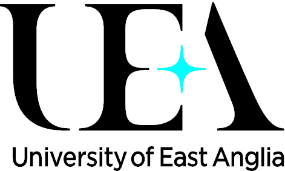

# Introduction to Python in Environmental Sciences
*EnvEast & Cefas workshop*

## What?
* The 5-day workshop organised by [EnvEast DTP](http://www.enveast.ac.uk/) and [Cefas](http://www.cefas.co.uk/) will give a hands-on introduction to [Python](http://www.python.org/) programming language.
* It will focus on the basics of the analysis and visualisation of the data commonly used in environmental sciences.
* **No previous Python experience is required!**

*[Download poster in PDF](poster/poster.pdf)*

## When?
8-12 January 2018

## Where?
Computer labs **ITCS 01.26** and **ITCS 0.17**, University of East Anglia

## Topics
* Python basics and programming environment
* Core scientific libraries: numpy, scipy, pandas
* Simple visualisation in matplotlib
* Plotting data on maps
* Working with environmental sciences data formats

[More...](programme.md)

## Registration and enquiries
* Denis, [d.sergeev@uea.ac.uk](mailto:d.sergeev@uea.ac.uk)
* Tiago, [tiago.silva@cefas.co.uk](mailto:tiago.silva@cefas.co.uk)

